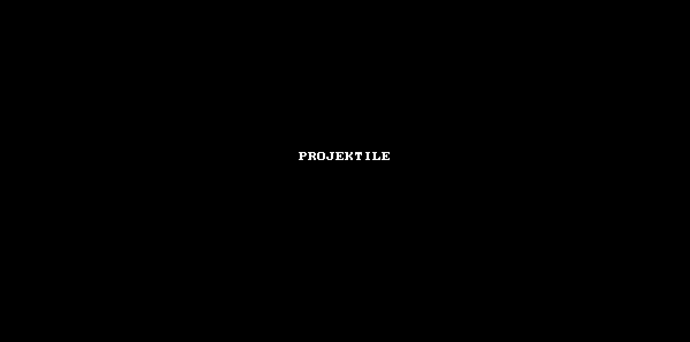

# Projektile 

Projektile is a simple projectile motion simulation program created with Python 3.3 and Pygame. It is based on a C programming project in one of the training I attended decade ago.

The program is still under development. All needed feature and enhancements are listed under Issues. Feel free to fork issue pull request or log issues.

## Development Environment:
- Python 3.3 with Pygame
- Windows 10 Creators Update
- PyCharm 2017 Community 2017.1

## How To Run The Program
- Dowload/Clone the repo
- Run $python3 App/main.py

